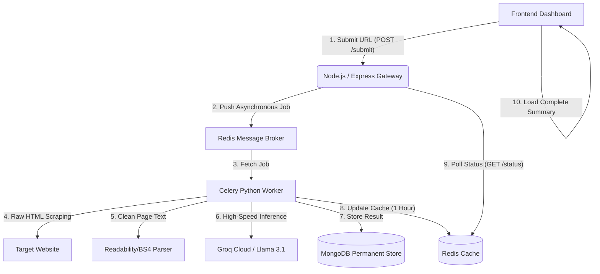

# 🛠️ InsightForge — AI-Powered URL Summary & Insight Engine

[](https://opensource.org/licenses/MIT)
[](https://fastapi.tiangolo.com/)
[](https://nodejs.org/)
[](https://docs.celeryq.dev/)
[](https://redis.io/)
[](https://www.mongodb.com/)
[](https://groq.com/)

**InsightForge** is a production-grade, highly optimized full-stack application designed to transform complex, wordy web pages into clean, actionable, high-level learning insights in **under 30 seconds**. 

By leveraging a robust microservices architecture, InsightForge distributes scraping and heavy AI inferences asynchronously, ensuring zero blockage and instant responsiveness.

---

## ✨ Features

*   **⚡ Sub-30s Asynchronous Summarization**: Instantly distills web pages into core summaries, targeted audiences, and key topics.
*   **🧠 Intelligent Content Extraction**: Employs `Readability` algorithms and `BeautifulSoup` to scrape clean article bodies, stripping away ads, banners, scripts, and trackers.
*   **🤖 State-of-the-Art LLM Processing**: Powered by Groq's high-speed inference engine running **Llama 3.1 (8B)** for human-like reading and extreme compression.
*   **🗄️ Multi-Layer Caching & Storage**:
    *   **Redis Cache**: Caches URL hashes and active job details for 1 hour to prevent redundant scraping and cut AI costs.
    *   **MongoDB**: Acts as a permanent warehouse for generated summaries and historical insights.
*   **⛓️ Background Worker Model**: Uses **Celery** task queues to handle scraping and AI jobs asynchronously, protecting the Node.js API gateway from heavy tasks.
*   **🎨 Premium UI Dashboard**: Beautiful responsive frontend presenting clean summaries, interactive topic badges, and a history log.

---

## 🏗️ Architecture Flow

InsightForge operates on a decoupled distributed system:



---

## 📂 Tech Stack

*   **Frontend**: HTML5, Vanilla CSS3 (modern glassmorphic design), JavaScript ES6.
*   **API Gateway**: Node.js, Express.js, MongoDB (Mongoose), Redis.
*   **Worker & Backend API**: Python 3.11+, FastAPI, Celery, Redis, PyMongo, Groq, BeautifulSoup4, Readability-lxml.
*   **Databases**: MongoDB (Permanent data storage), Redis (In-memory cache & Celery broker).

---

## 🚀 Setup & Execution

Follow these steps to run **InsightForge** locally:

### 1. Prerequisites
Ensure you have the following installed on your machine:
*   [Node.js](https://nodejs.org/) (v18+)
*   [Python](https://www.python.org/) (v3.10+)
*   [Redis Server](https://redis.io/downloads/) (Running on `localhost:6379`)
*   [MongoDB Server](https://www.mongodb.com/try/download/community) (Running on `localhost:27017`)

---

### 2. Configure Environment Variables
Create a `.env` file inside the `worker-python/` directory:

```env
GROQ_API_KEY=your_groq_api_key_here
HF_TOKEN=your_huggingface_token_here (optional)
```

---

### 3. Start the Services

Open three separate terminals in your workspace:

#### Terminal 1: Python Celery Worker
Start the Celery asynchronous worker to process incoming scraping requests:
```bash
cd worker-python
python -m celery -A celery_app:app worker --loglevel=info --pool=solo
```

#### Terminal 2: Node.js API Gateway
Start the Express API gateway to coordinate requests and database entries:
```bash
cd backend-node
npm install
node index.js
```

#### Terminal 3: Python FastAPI Server (Optional / Extra API)
If using the FastAPI service:
```bash
cd worker-python
pip install -r requirements.txt
python -m uvicorn api:fastapi_app --port 8000 --reload
```

---

### 4. Run the Frontend
Simply open `frontend/index.html` directly in your browser or run it via a local live server to interact with the dashboard!

---

## 🔒 Security & Best Practices

*   **Zero hardcoded secrets**: All API keys, database credentials, and Hugging Face/Groq secrets are loaded securely using `.env` configurations.
*   **Clean Repository Boundaries**: Built-in `.gitignore` prevents virtual environments (`.venv/`), Node dependencies (`node_modules/`), local config folders (`.vscode/`), and `.env` files from ever leaking onto GitHub.

---

## 📝 License
This project is licensed under the MIT License. See [LICENSE](LICENSE) for details.

Developed with ❤️ by [VisionStack-404](https://github.com/VisionStack-404).
The first pull request
## Update for Pull Shark Achievement1
